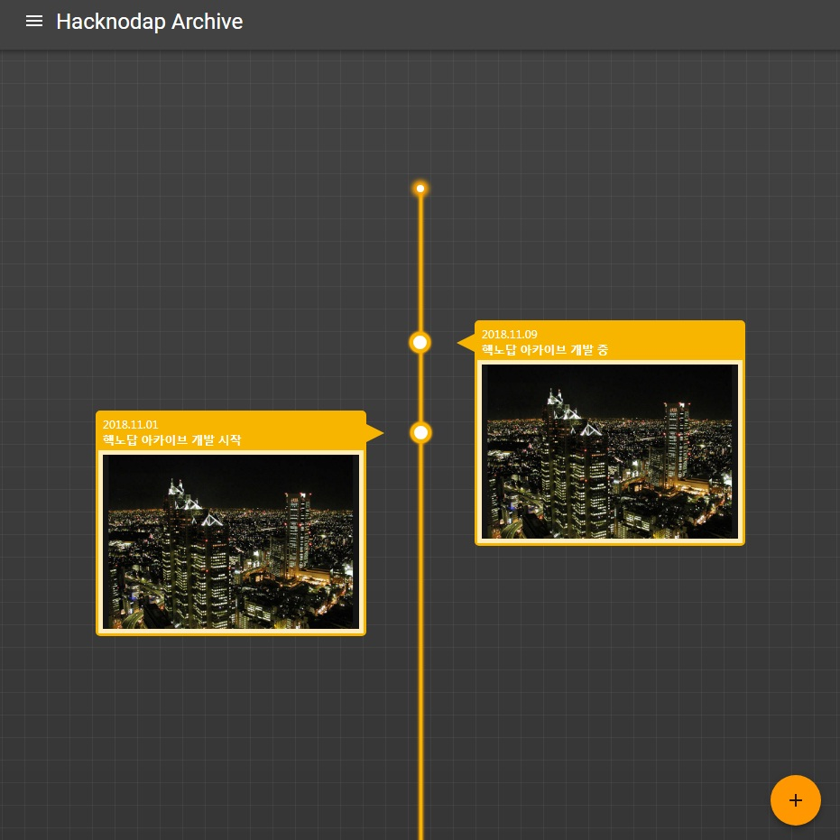

# 핵노답 아카이브(Hacknodap Archive)

소규모 그룹의 활동 기록을 관리하고 보기 편하게 활동 기록 타임라인을 지원하는 웹앱.

맨날 여행 가놓고 막상 기록을 남기기 메우 귀찮아하는 핵노답 9인방(본인 포함)을 위해 만들고 있다.
이런 게 있으면 핵노답이라도(본인 포함) 뭐라도 쓰지 않을까?

## Screenshots (in working...)

## Todo

* timeline end에 current time 표시하기
* 각 history에 유형(ex: 모임, 여행, ...)을 추가해서 다른 색으로 표시
* timeline에 연도별 spliter 추가
* 메인 화면의 history 부분의 오른쪽 하단에 사진 몇 개가 업로드 되어 있는지 표시
* ~~RESTful Server에서 Image를 직접 노출시켜야 할지, 파일 시스템으로 관리할지 고민~~
* ~~AddDialog 완성하기~~

## Useful Sites

* [CSSmatic](https://www.cssmatic.com/gradient-generator)
* [CSS Timeline Examples](https://freefrontend.com/css-timelines/)
* [W3C CSS Timeline](https://www.w3schools.com/howto/tryit.asp?filename=tryhow_css_timeline)
* [Material Color Tool](https://material.io/tools/color/#!/?view.left=0&view.right=0&primary.color=212121)

## Development Memo

* 14.04 LTS에서 Mongodb install 시 mongodb-server부터 설치할 것(apt-get install mongodb-server)
* mongodb 구조 : archiveDB.activities.blah